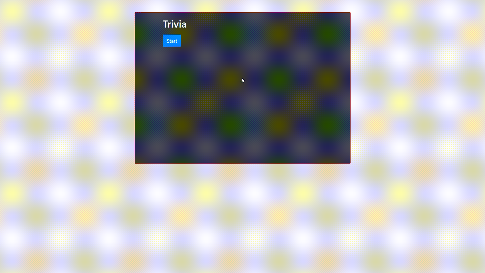

# TriviaGame

This is a time trivia style quiz, where users have 15 seconds to answer three questions. Time starts when the start button is clicked and the questions appear on the screen. Only one answer can be selected per question. Answers will be automatically submitted after the 15 seconds have elapsed. Results will be immediately posted after 15 seconds, and an option to restart the quiz is given. 

## Technologies Used

* HTML
* CSS
* Javascript
* jQuery

## Authors

* Alfred Chan